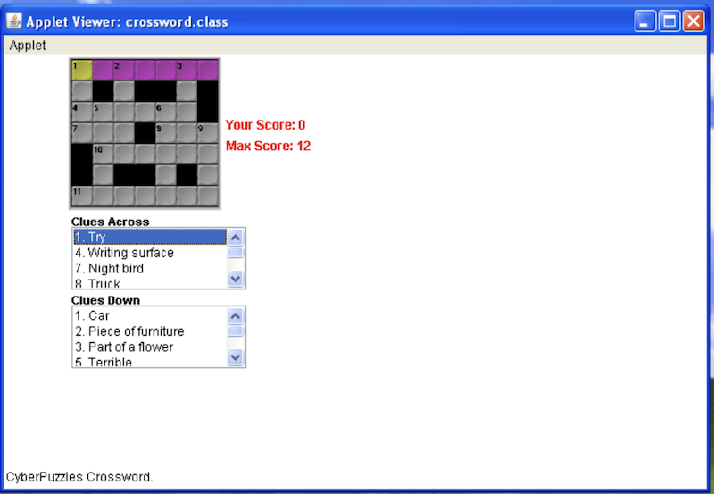
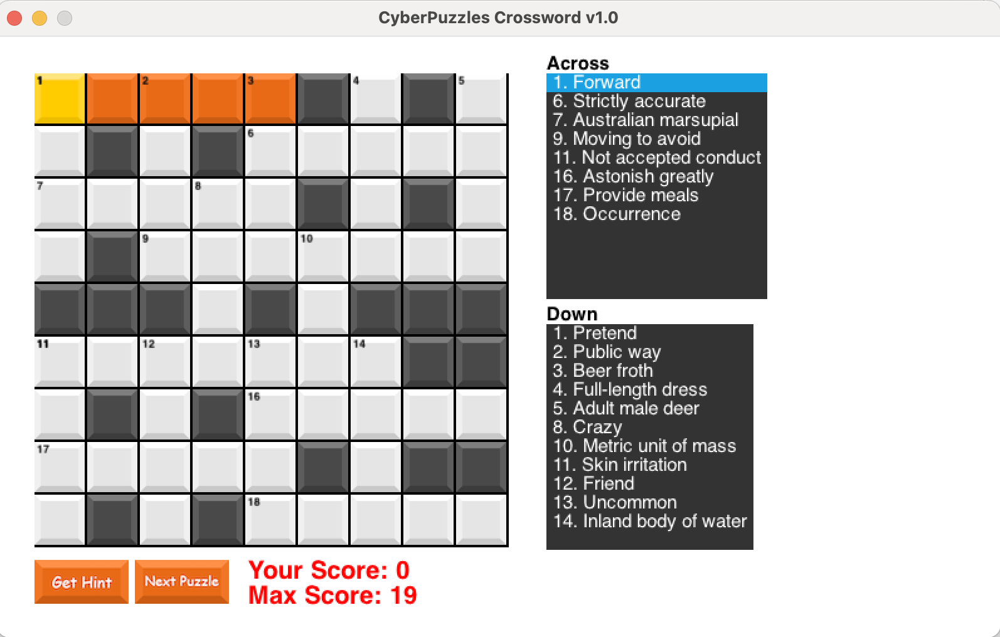

<div align="center">

# CyberPuzzles - Crossword - v1.0.0-beta2

A Monogame C# .Net 8.0 Core port of a Java Applet game I co-wrote back in 1997.

**Full co-authoring credits go to the ObjectCentric team (Bryan Richards and Neil Reading) from the OzEmail days (circa 1997)**

</div>

## Version History:

- 1.0.0-beta2- Major refactor- restructured code with a focus on performance and reduced memory usage.
- 1.0.0 - Initial release for initial feedback.

---

### Description:

A true to life interactive crossword game that uses the keyboard and mouse for input.
Leverages a minimal API that uses the original data format for crossword data. If it cannot contact the Data service API, it will use a test data set for validation and testing purposes.

This game was written in C#12 and leverages the Microsoft .Net 8 core framework with [Monogame](https://monogame.net/index.html) and a .Net Minimal WebAPI for loading the puzzle datasets.

This was ported across from a **very** old Java SDK to use .Net 8.0, C# 12 and nullable types but uses many of the older style programming techniques from that time.

To play the game you can use the keyboard - Arrow keys and the mouse to navigate and the spacebar to change the navigation from across to down and vice versa.

Please feel free to share this and make any changes as you see fit.

Old Java version Screenshot:



New version Screenshot:



---

### Software Requirements:

- [Microsoft .Net 8.0+ Core SDK/Runtime Framework](https://dotnet.microsoft.com/en-us/download/dotnet/8.0)
- [Visual Studio Code](https://code.visualstudio.com/download)
- [C# DevKit](https://marketplace.visualstudio.com/items?itemName=ms-dotnettools.csdevkit)
- Optional - [JetBrains Rider](https://www.jetbrains.com/rider/)

---

### Project Structure:

The Crossword solution is structured with the following projects:

- Crossword - The Main crossword game - All the main game play and puzzle logic lives here.
- Crossword.API - The WebAPI Data service - Parses the local dataset files and randomly returns a string containing the dataset to be parsed by the Crossword.Parser project.
- Crossword.Data - Acts as the interface between the main Crossword and the WebAPI to retrieve data.
- Crossword.Entities - Contains the main data objects for the puzzle data and game play state.
- Crossword.Parser - The parser that transforms the puzzle data set from the API to the CrosswordData object for use by the crossword.
- Crossword.Puzzle - The core puzzle state machine - Square and ClueAnswer reference mapping for the in-play crossword.
- Crossword.Shared - A shared class library that has Config, Constants, Logger and ParserUtils functions that are shared across the projects.
- Crossword.UI - Provides the supporting UI elements of the crossword.
- Crossword.EventHandlers - Provides the Event handling for the crossword such as mouse and keyboard input.

---

### MacOS ARM/X64 Specific setup steps:

1. [Download](https://dotnet.microsoft.com/en-us/download/dotnet/8.0) the installers for the Arm64 and x64 versions of the .NET sdk - The mgcb content editor doesn’t work without using the x64 version
2. At the end of your .zshrc or bash or whatever your using set this - `export PATH="/usr/local/share/dotnet/x64:$PATH"`
3. You’ll also run into a free image error to solve that you need to install homebrew and then run - `brew install freeimage`
4. and then link it - `sudo ln -s /opt/homebrew/Cellar/freeimage/3.18.0/lib/libfreeimage.dylib /usr/local/lib/libfreeimage`

[source](https://community.monogame.net/t/tutorial-for-setting-up-monogame-on-m1-m2-apple-silicon/19669)

---

### Local Build steps:

1. Clone the repo to your local machine - `git clone https://github.com/AaronSaikovski/CyberPuzzles.git`
2. It will create a folder 'CyberPuzzles' and then 'cd' into the 'CyberPuzzles' folder.
3. Check that the projects and the `CyberPuzzles.sln` (solution file and projects have been cloned) - List all the files in the folder.
4. run `dotnet clean`.
5. run `dotnet restore --force` to restore the nuget packages.
6. run `dotnet build` to ensure there aren't any build errors, there may be some warnings. - (If you are on MacOS and get some compiler errors with the build, check the MacOS setup steps above.)
7. cd into the 'Crossword.Application' folder.
8. type `dotnet run` and the crossword should appear.
9. There will be an error on startup - "An error occurred: One or more errors occurred. (Connection refused (localhost:7175))" - the crossword is trying to connect to the local instance of the WebAPI, ignore this for now.

To build locally for your target native platform:

```bash
## Windows-
# x86
dotnet build -r win-x64 -c Release

# ARM
dotnet build -r win-arm64 -c Release

## Linux
# x86
dotnet build -r linux-x64 -c Release

# ARM
dotnet build -r linux-arm64 -c Release

## MacOS
# x86
dotnet build -r osx-x64 -c Release

# ARM
dotnet build -r osx-arm64 -c Release
```

To create a publish release locally for your target platform:

```bash
## Windows
# x86
dotnet publish -r win-x64 -c Release

# ARM
dotnet publish -r win-arm64 -c Release

## Linux
# x86
dotnet publish -r linux-x64 -c Release

# ARM
dotnet publish -r linux-arm64 -c Release

## MacOS
# x86
dotnet publish -r osx-x64 -c Release

# ARM
dotnet publish -r osx-arm64 -c Release
```

**Please note that this game has been tested on MacOS ARM (M1) and Windows x86 only - it hasn't been tested on other platforms due to some limitations with MonoGame.**

---

### Data Service WebAPI:

Use your favourite tool to deploy to Azure and ensure that the following settings are configured for the web application:

- WebApp name: crossworddatasvc (The full WebAPI url should be: https://crossworddatasvc.azurewebsites.net/getcrosswordpuzzledata)
- WebApp SKU: F1
- WebApp Framework: .Net 8.0 Core LTS

The WebAPI also uses an API Key set in the variable 'XApiKey' - This has a default value but can be changed to another value. I will document this more in the future.

This has only been tested on Azure Web Apps and I will containerise this in the future to make this more portable.

---

### Known Bugs/Issues:

Please report all bugs and the running list of know issues is [here](https://github.com/AaronSaikovski/CyberPuzzles/issues).

---

### Items for future releases:

- GitHub action for building and releasing onto all platforms.
- Reformat puzzle data format to use JSON instead of the custom data file format.
- Create a Docker file to host the Dataservice API.
- WebAssembly to be able to be played in a browser.

---
